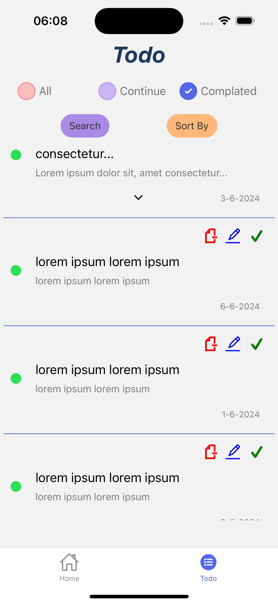
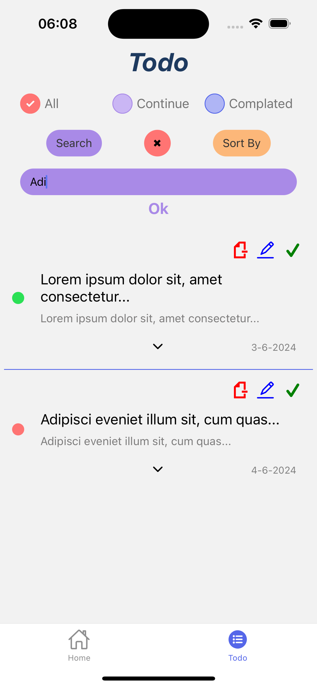
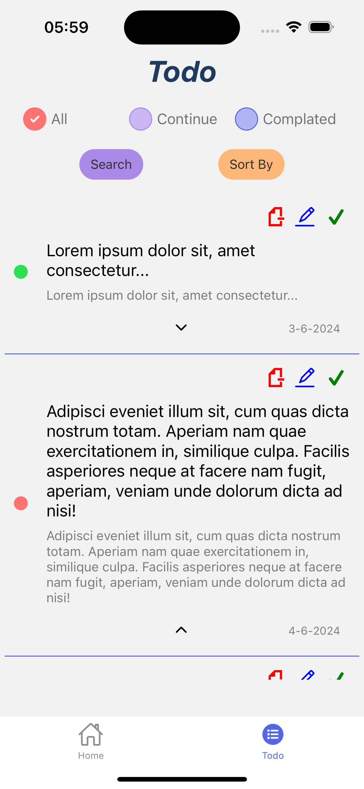
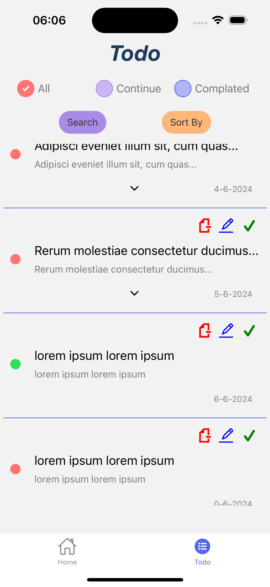

# Welcome to your Todo app 👋

A sleek and efficient todo app built with React Native. Organize your tasks with features like sorting and search filtering for a seamless user experience
<p align="center">
<a href="https://www.npmjs.com/~nestjscore" target="_blank"></a>
<a href="https://www.focusspark.tech" target="_blank"><a>
<a href="https://www.focusspark.tech" target="_blank"></a>


<p align='center'>
  
  
  
  
  
  
  
  
  
  
  
  
 

</p>


</p>


## Get started

1. Install dependencies

   ```bash
   npm install
   ```

2. Start the app

   ```bash
    npx expo start
   ```

In the output, you'll find options to open the app in a

- [development build](https://docs.expo.dev/develop/development-builds/introduction/)
- [Android emulator](https://docs.expo.dev/workflow/android-studio-emulator/)
- [iOS simulator](https://docs.expo.dev/workflow/ios-simulator/)
- [Expo Go](https://expo.dev/go), a limited sandbox for trying out app development with Expo

You can start developing by editing the files inside the **app** directory. This project uses [file-based routing](https://docs.expo.dev/router/introduction).

## Get a fresh project

When you're ready, run:

```bash
npm run reset-project
```

This command will move the starter code to the **app-example** directory and create a blank **app** directory where you can start developing.
## Contact

<p align="center">
<table align="center">
  <tr align="left">
    <th><b>SEFA DEMİRTAŞ</b></th>
  </tr>
  <tr>
    <td>Software Developer</td>
  </tr>
  <tr>
    <td><a href="mailto:sefa.demirtas91@gmail.com">sefa.demirtas91.gmail.com</a></td>
  </tr>
</table>
</p>
